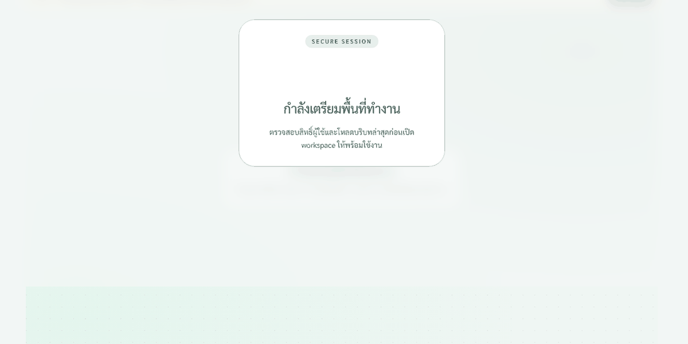

<div align="center">

# 🌌 INNOMCP

### Your personal AI agent workspace. Manus-grade UI. Free, open source, self-hostable.

**Thai-first multilingual • 10+ AI providers • MCP tool ecosystem • RAG memory • Live artifact panel**

[](https://github.com/mdes-innova-th/innomcp/stargazers)
[](https://github.com/mdes-innova-th/innomcp/network/members)
[](https://opensource.org/licenses/MIT)
[](https://github.com/mdes-innova-th/innomcp/releases)
[](CONTRIBUTING.md)
[](https://en.wikipedia.org/wiki/Bangkok)

[Demo](#-demo) • [Quick Start](#-quick-start) • [Why INNOMCP](#-why-innomcp) • [Architecture](#-architecture) • [Contributing](#-contributing) • [Roadmap](docs/MASTER_REVIEW.md)

</div>

---

## ✨ What is INNOMCP?

INNOMCP is a **self-hostable, multi-agent AI workspace** that gives you the same feeling as [Manus.im](https://manus.im) — a real-time activity panel, parallel tool dispatch, an artifact system, and a living chat that streams every agent step. But INNOMCP is:

| | Manus.im | INNOMCP |
|---|---|---|
| **Price** | $39/mo Pro | **Free forever** |
| **Source** | Closed | **MIT licensed** |
| **Self-host** | ❌ | **✅ Docker one-liner** |
| **Thai / low-resource languages** | Hit-or-miss | **First-class** |
| **Tool ecosystem** | Proprietary | **Model Context Protocol (MCP)** |
| **AI providers** | 1 | **10+ (Claude, GPT, local Ollama, MDES)** |
| **Memory & RAG** | Per-account | **Per-project, fully local** |
| **Bring your own model** | ❌ | **✅ Any Ollama, OpenAI-compatible, or Anthropic API** |

> 🎯 Built and battle-tested by MDES-Innova (Bangkok, Thailand) for Thai-language first, multilingual second.

---

## 🎬 Demo



> 6-frame live demo · 1280×600 · slideshow of the most-engaging flows

**More screenshots:**
- 🌦️ [Weather + tool panel](docs/screenshots/hero-weather-response.png) — TMD API + NWP forecast
- 🧮 [Calculator tool](docs/screenshots/hero-calculator-tool.png) — parallel dispatch visible
- 📊 [Evidence dashboard](docs/screenshots/hero-evidence-dashboard.png) — structured content
- 📱 [Mobile responsive](docs/screenshots/hero-mobile-view.png) — bottom nav layout

Want a real recording? Run `pnpm dev` and use any screen recorder — PRs adding `docs/demo.webm` are very welcome!

---

## 🚀 Quick Start

### Prerequisites
- **Node.js 20+**, **pnpm 11+**, **Docker** (for MariaDB)
- 4 GB RAM minimum (8 GB recommended for local LLM)
- A free API key for **at least one** of: Anthropic, OpenAI, Ollama, or MDES

### 1. Clone and install
```bash
git clone https://github.com/mdes-innova/innomcp.git
cd innomcp
pnpm install
```

### 2. Configure your providers
```bash
cp innomcp-node/.env.example innomcp-node/.env
cp innomcp-next/.env.example innomcp-next/.env.local
# Edit both .env files — pick whichever providers you have keys for
```
> **Zero-config mode**: if you have Ollama running locally, INNOMCP will discover it automatically.

### 3. Start the database
```bash
docker compose up -d mariadb
```

### 4. Launch the full stack
```bash
pnpm dev
```
Open **http://localhost:3000** — you'll see the chat UI. The backend (`:3011`) and MCP server (`:3012`) start automatically.

### Or — one command with Docker
```bash
git clone https://github.com/mdes-innova-th/innomcp && cd innomcp && docker compose up -d
# Then visit http://localhost:3000
```
*(Docker Compose orchestration is in progress — see [issue tracker](https://github.com/mdes-innova-th/innomcp/issues). For now, use the pnpm dev path above.)*

### 5. Try a query
> *"สภาพอากาศที่เชียงใหม่วันนี้เป็นยังไงบ้าง"*
> (Weather in Chiang Mai today?)

Watch the **right panel** light up with the Thai Weather tool, NWP forecast tool, and a real-time streamed answer. Toggle providers from the sidebar to compare Claude vs GPT vs local Ollama on the same query.

---

## 💡 Why INNOMCP?

### 🧠 Manus-style strategic agent loop
- **Conductor → parallel dispatch → critique → revise** (see [`answerPlanner.ts`](innomcp-node/src/utils/mcp/answerPlanner.ts))
- 10+ specialized agents route dynamically based on query type
- Each step is **visible and auditable** in the live computer panel
- A **critique layer** re-runs weak answers before they reach the user

### 🌏 Thai-first by design
- 4 dedicated Thai tools: weather (TMD), NWP forecast, geography (77 provinces), knowledge corpus
- Native Thai typography (TH Sarabun New for reports)
- Thai word-wrapping utility (`.break-thai-words`) — no more `กรุงเทพมหานคร` blowing up the layout
- Bilingual chat UX; lead Thai / fallback English

### 🔌 MCP tool ecosystem
- Ships with **20+ built-in MCP tools** (shell, web fetch, data analysis, weather, etc.)
- Plug in any [MCP-compatible server](https://modelcontextprotocol.io) in 5 lines of config
- Sandboxed shell execution, SSRF-protected web fetch, JSON-schema-validated tools

### 🧩 10+ AI providers, swap with a click
| Provider | Model | Use case |
|---|---|---|
| **Claude Sonnet 4.6** | `claude-sonnet-4-6` | Hard reasoning, long context |
| **Claude Haiku 4.5** | `claude-haiku-4-5` | Speed, cheap Thai |
| **OpenAI GPT-4o-mini** | `gpt-4o-mini` | Fallback chain |
| **GitHub Copilot** | `gpt-4o` | Code generation |
| **Local Ollama** | any (e.g. `llama3.2`) | 100% private, offline |
| **MDES Ollama** (Thai-optimized) | `gpt-oss:120b-cloud` | Thai excellence |
| + 4 more via OpenAI-compatible API | — | Bring your own |

> 🚦 Live provider health + latency at `/api/providers/health-check` — the conductor auto-reroutes when a provider degrades.

### 🗂️ Real workspace, not a chat bubble
- **Artifact panel**: Markdown, code, charts (CSV → SVG), files — preview, download, re-render
- **Project memory**: scoped to each project, with RAG retrieval
- **Task history**: full audit trail with star ratings, replay, JSON export
- **Dashboard**: stats, pinned artifacts, search across everything

### 🛡️ Production-grade
- **59/59 full system tests** + **61/61 browser signoff** (Playwright) on every PR
- **Crash forensics**: `uncaughtException` / `unhandledRejection` → `logs/backend-crash.log`
- **Correlation IDs** flow from request → MCP → external API → log
- **JWT auth**, rate limiting, SSRF protection, SQL-injection-safe tool surface
- **PM2 ecosystem file** for one-command production deploy

---

## 🏗️ Architecture

```
innomcp/
├── innomcp-next/          # Next.js 15 App Router — chat UI, artifacts, dashboard
├── innomcp-node/          # Node.js 20 + Express 5 — backend, agents, RAG
├── innomcp-server-node/   # MCP server (20+ tools) — Model Context Protocol
├── mariadb/               # MariaDB 11 (Docker) — chat history, memories, projects
├── screenshots/           # Playwright + product audit screenshots
├── docs/                  # API docs, signoff evidence, MASTER_REVIEW.md
└── .planning/             # Phase plans, retrospectives
```

**Request flow** (one user query, simplified):
```
[Next.js chat] → /api/chat
   ↓
[Conductor] decides: 3 agents in parallel (weather + nwp + critique)
   ↓
[Agent 1] → MCP tool: thaiWeatherTool → TMD API
[Agent 2] → MCP tool: nwpForecastTool → NWP model
[Agent 3] → reads Agent 1+2, composes answer
   ↓
[Critique layer] re-evaluates; if weak, re-runs with different agent
   ↓
[Streamed response + artifact] → Next.js chat + artifact panel + live activity log
```

See [`docs/reports/MASTER_REVIEW.md`](docs/reports/MASTER_REVIEW.md) for the full phased worklist, security audit, and roadmap.

---

## 🛠️ Tech Stack

| Layer | Tech |
|---|---|
| Frontend | Next.js 15, React 19, TypeScript, Tailwind 4, Framer Motion |
| Backend | Node.js 20, Express 5, TypeScript, MariaDB 11, Redis (optional) |
| MCP | Custom MCP server (`innomcp-server-node`) — see `mcp/tools/` |
| AI | Anthropic Claude, OpenAI GPT, Ollama (local + MDES), GitHub Copilot |
| Tests | Jest (unit), Playwright (e2e + signoff), full-system smoke |
| Deploy | Docker, PM2, GitHub Actions |

---

## 🤝 Contributing

We welcome PRs! The repo is designed for new contributors:

- **First-time?** Start with `good first issue` — look for `phase-c-living-agent-chat-opus-recovery` and `e2e` labels
- **UX / i18n help needed**: Thai copy, RTL prep, mobile sweep
- **New MCP tool?** Drop it in `innomcp-server-node/src/mcp/tools/` — register in `server.ts`
- **New provider?** Implement the `Provider` interface in `innomcp-node/src/services/providers/`

Read [CONTRIBUTING.md](CONTRIBUTING.md) for the full guide, then open a draft PR.

### Sub-agent catalog
INNOMCP ships with 10 specialized sub-agents (planner, dev, tester, reviewer, designer, system-analyst, program-analyst, connector, search, hermes) — see [`AGENTS.md`](AGENTS.md). The repository is the agent's living workspace.

---

## 📊 Project status

| Surface | Status | Last verified |
|---|---|---|
| Full system gate (59 tests) | ✅ 59/59 | 2026-04-28 |
| Browser signoff (61 tests) | ✅ 61/61 | 2026-04-28 |
| Playwright regression (214 tests) | ✅ 214/214 × 3 rounds | 2026-05-11 |
| Public release | 🟡 in progress | see `docs/reports/MASTER_REVIEW.md` |
| Thai language coverage | ✅ First-class | — |
| Mobile responsive (375–1024px) | 🟡 sweep in progress | Phase E |

---

## 🌐 Community & support

- **Issues / feature requests**: [github.com/mdes-innova/innomcp/issues](https://github.com/mdes-innova/innomcp/issues)
- **Discussions**: [github.com/mdes-innova/innomcp/discussions](https://github.com/mdes-innova/innomcp/discussions)
- **MDES-Innova**: [mdes-innova.online](https://mdes-innova.online)
- **Email**: mdes.innovation@gmail.com

---

## ⭐ Show your support

If INNOMCP is useful to you, **a star is the biggest compliment** — it tells other devs this is worth their time. And it costs you 3 seconds.

<a href="https://github.com/mdes-innova/innomcp">
  
</a>

---

## 📜 License

[MIT](LICENSE) — free for commercial and personal use. See [`LICENSE`](LICENSE) for the full text.

---

<div align="center">

**Made with ☕ and 🌶️ in Bangkok, Thailand**

[⭐ Star](https://github.com/mdes-innova/innomcp) · [🐛 Report bug](https://github.com/mdes-innova/innomcp/issues) · [💡 Request feature](https://github.com/mdes-innova/innomcp/issues/new)

</div>
