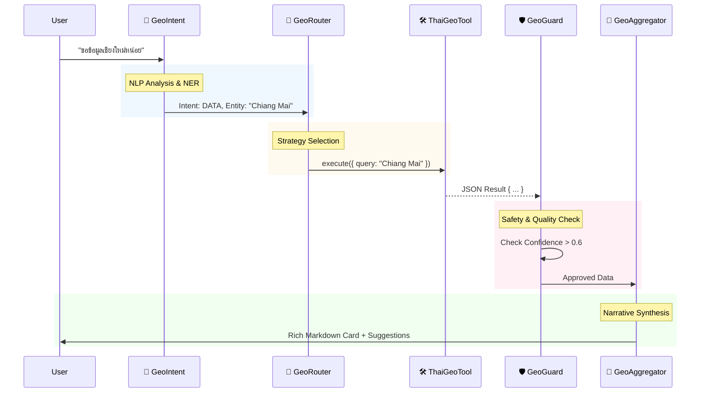

# GEO INTELLIGENCE ARCHITECTURE V2 (Multi-Agent System)

## 🌟 Executive Summary

This architecture transforms the raw `thai_geo_tool` into a **Cognitive Geographic Intelligence Layer (CGIL)**.
Instead of a simple function call, we deploy a **Multi-Agent Orchestration** pattern where specialized micro-agents (Intent, Router, Guard, Aggregator) collaborate to deliver context-aware, safe, and rich geographic insights.

---

## 🏗️ Architecture Components

### 1. Geo Intent Agent (The "Ear") 🧠

**Role**: Natural Language Understanding & Context resolution.
**Responsibility**: Decides _if_ and _why_ a query is geographic.

- **Logic Pipeline**:
  1.  **Context Analysis**: Checks conversation history (e.g., "How about weather _there_?").
  2.  **NER (Thai)**: Extracts `Location`, `Landmark`, `Distance`, `Direction`.
  3.  **Intent Classification**:
      - `GEO_DATA`: Facts, stats, administrative hierarchy.
      - `GEO_MAP`: Visual requests ("Show me", "Map of").
      - `GEO_ROUTE`: Navigation ("How to go", "Distance").
      - `GEO_EXPLORE`: Nearby, tourist spots.
- **Output Signal**: `ActionableIntent { type, entities[], confidence }`

### 2. Geo Router Agent (The "Traffic Controller") 🔀

**Role**: Dynamic Tool Selection & Strategy.
**Responsibility**: Maps intent to the optimal execution path.

- **Routing Logic**:
  - **Direct Path**: High confidence `GEO_DATA` -> **`thai_geo_tool`**.
  - **Visual Path**: `GEO_MAP` -> **`static_map_agent`** (Generates Image URL).
  - **Composite Path**: `GEO_EXPLORE` -> **`thai_geo_tool`** (Center) + **`places_api`** (Radius Search).
  - **Fallback Path**: Low confidence -> **`clarification_agent`** ("Did you mean X or Y?").

### 3. Geo Guard Agent (The "Safety Valve") 🛡️

**Role**: Quality Assurance & Safety Compliance.
**Responsibility**: Validates data _before_ it reaches the user.

- **Validation Protocols**:
  - **Confidence Gate**: Reject results with `confidence < 0.6`.
  - **Ambiguity Detector**: Detects 1-to-Many mappings (e.g., "Ban Mai" -> 50 results) and forces disambiguation.
  - **Sensitive Zone Filter**: Redacts or flags results within military/royal restricted zones.
  - **Hallucination Check**: Cross-references `lat/lon` with administrative boundaries.

### 4. Geo Aggregator Agent (The "Storyteller") 🧩

**Role**: Response Synthesis & UX Design.
**Responsibility**: Composes dry data into a compelling narrative.

- **Capabilities**:
  - **Adaptive Formatting**:
    - Mobile -> Compact Cards.
    - Desktop -> Rich Markdown with Tables.
  - **Contextual Enrichment**: Adds "Did you know?" facts or "Nearby" suggestions.
  - **Visual Binding**: Injects static map images alongside text.
  - **Language Tone**: Adjusts formality based on user persona (Formal/Casual).

---

## 🔄 Sequence Diagram (Multi-Agent Flow)

---

## 🚀 Implementation Roadmap

This design assumes a modular codebase in `scripts/geo/` where each agent is a Class capable of independent evolution.

| Component      | Status  | Tech Stack                         |
| :------------- | :------ | :--------------------------------- |
| **Intent**     | 🟡 Spec | Regex / NLP / Context Window       |
| **Router**     | 🟡 Spec | Decision Tree / Strategy Pattern   |
| **Guard**      | 🟡 Spec | Zod Schema / Heuristics            |
| **Aggregator** | 🟡 Spec | Template Engine / Markdown Builder |

> **Note**: This architecture is designed to be **LLM-Agnostic**. It can run deterministically (Code) or be powered by small SLMs (gemma/llama) for decision making.
