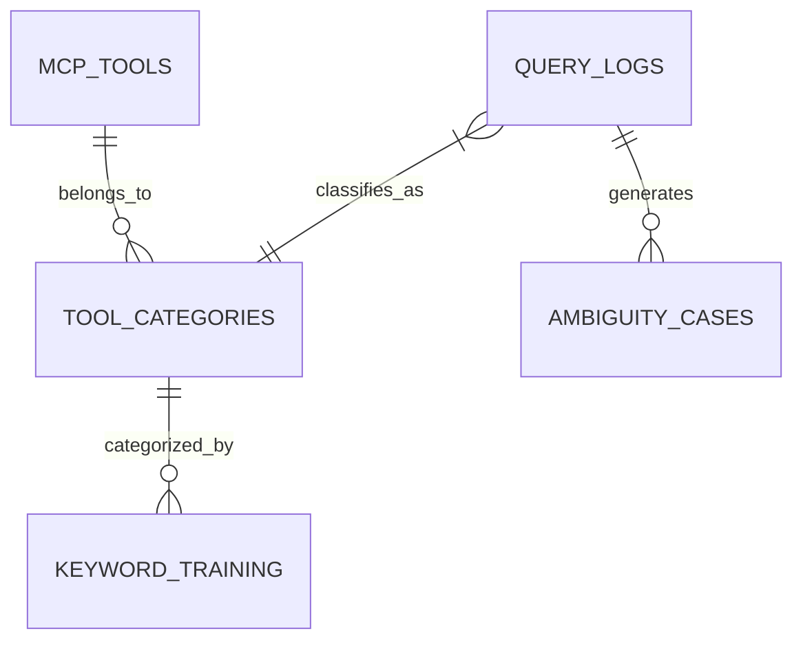

# 🧠 Semantic Keyword DB Architecture (2026 Edition)

## Overview
This document defines the database schema for the **God-Tier Context-Aware Intent Engine**. The goal is to move from hardcoded Regex/Keyword arrays to a dynamic, self-learning database that supports:
1.  **Multilingual Support**: Thai & English native support.
2.  **Weighted Keywords**: Confidence scores (0.0 - 1.0) to handle ambiguity.
3.  **Ambiguity Detection**: Tracking specific queries that confused the AI.
4.  **Self-Learning**: Updating scores based on user feedback/correction.

## Entity Relationship Diagram (ERD)

## Schema Definitions

### 1. `tool_categories` (Master Data)
Defines the abstract categories of tools (e.g., 'weather', 'earthquake').
*Replaces hardcoded string checks.*

### 2. `keyword_training` (The Brain)
The core mapping table used by `GodTierRouter.ts`.

| Column | Type | Description |
|--------|------|-------------|
| `id` | BIGINT | Primary Key |
| `keyword` | VARCHAR(100) | The trigger word (e.g., "ฝนตก", "raining") |
| `category` | VARCHAR(64) | Maps to `tool_categories.id` |
| `confidence_score` | FLOAT | 0.0 - 1.0 (Manual or ML adjusted) |
| `priority_level` | ENUM | 'critical', 'high', 'normal', 'low' |
| `language` | CHAR(2) | 'th', 'en', 'xx' (mixed) |
| `hit_count` | INT | Number of times this keyword matched |
| `last_used_at` | TIMESTAMP | For pruning unused keywords |

### 3. `query_logs` (History)
Stores every user query and the router's decision. (Already exists in `tables.sql`, but ensuring compatibility).

### 4. `ambiguity_cases` (Failures)
Stores cases where Top1 and Top2 scores were too close, requiring LLM judgment.

## Seeding Strategy (Migration from Code)
1.  **Extract**: Parse `godTierRouter.ts` hardcoded `CATEGORIES` array.
2.  **Transform**: Convert to SQL INSERT statements.
3.  **Load**: Run `seed_keywords.sql`.

## Future Improvements
- **Vector Embeddings**: Add `embedding` column (BLOB/VECTOR) to `keyword_training` for Semantic Search directly in DB (if upgrading to MariaDB Vector or pgvector later).
- **User Feedback Loop**: If user says "Wrong tool", decrement `confidence_score` for the triggered keyword.
