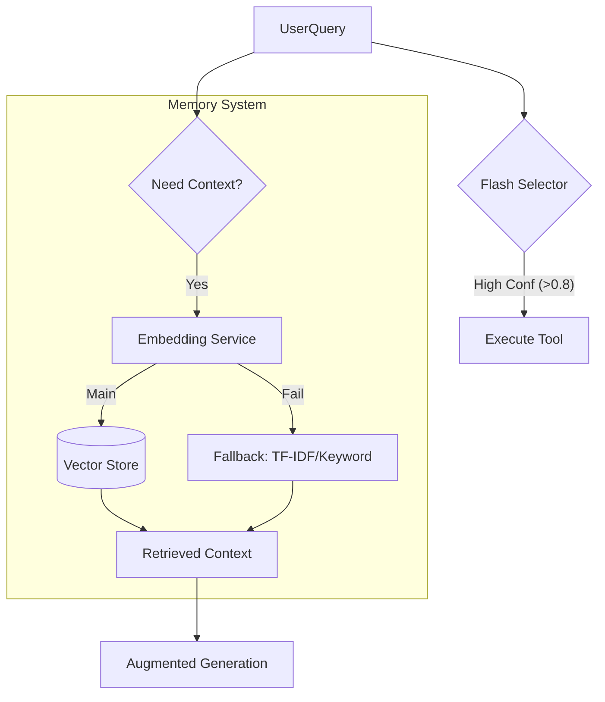

# Phase 6: Learning, Memory & RAG (Specification)

## 1. Objectives

- **Context Awareness**: Model remembers past interactions and user preferences.
- **Knowledge Retrieval (RAG)**: Access data from `workspace-storage`, `database`, and `tool outputs`.
- **Performance**: **MUST NOT** degrade Phase 4 (Speed) performance. RAG should be async or on-demand.
- **Reliability**: Robust fallback if AI Embedding models are unavailable.

## 2. Architecture

### 2.1 The "Dual-Path" Intelligence Pipeline

To maintain speed, we separate "Fast Reflex" (Tools) from "Deep Thought" (Memory/RAG).

### 2.2 Components

#### A. Embedding Service (`src/memory/embedding.ts`)

- **Primary**: `nomic-embed-text` (via Ollama).
- **Fallback**: `TF-IDF` / `Keyword Matching` (if Ollama down or timeout > 500ms).
- **Interface**: `embed(text: string): Promise<number[] | null>`

#### B. Knowledge Sources

1.  **DB Keywords**: Existing `keywords` table in MariaDB (Mapped to Tools).
2.  **Workspace Storage**: Files in `workspace-storage/data/users/*/documents`.
    - _Indexer_: Periodically scans and indexes simple text files (.txt, .md).
3.  **Short-term History**: In-memory conversation buffer.

#### C. Integration (`src/intelligence/pipeline.ts`)

- Update `IntelligencePipeline` to emit `memory_lookup` events.
- Memory lookup happens **asynchronously** and doesn't block the initial `tool_start` if confidence is high.
- If confidence is low, pipeline WAITS for memory (RAG) before falling back to LLM.

## 3. Data Flow

1.  **Ingestion**: Background job indexes `workspace-storage` files every X minutes or on change.
2.  **Retrieval**:
    - User asks: "What is in file A?"
    - Pipeline triggers RAG.
    - System retrieves File A content.
    - Pipeline feeds content to `final_answer`.

## 4. Fallback Strategy (Crucial)

- If `nomic-embed-text` fails (connection error) or takes > 1s:
  - Log warning.
  - Switch to **Keyword Search** (Regex/substring match against indexed content).
  - Return best keyword matches.

## 5. Deliverables (Round C)

- `EmbeddingService` (with Fallback).
- `VectorStore` (Simple JSON-based or light vectordb adaptor).
- `MemoryTool`: Explicit tool for user to ask "Read my config file".
- Integration tests proving speed & fallback.
