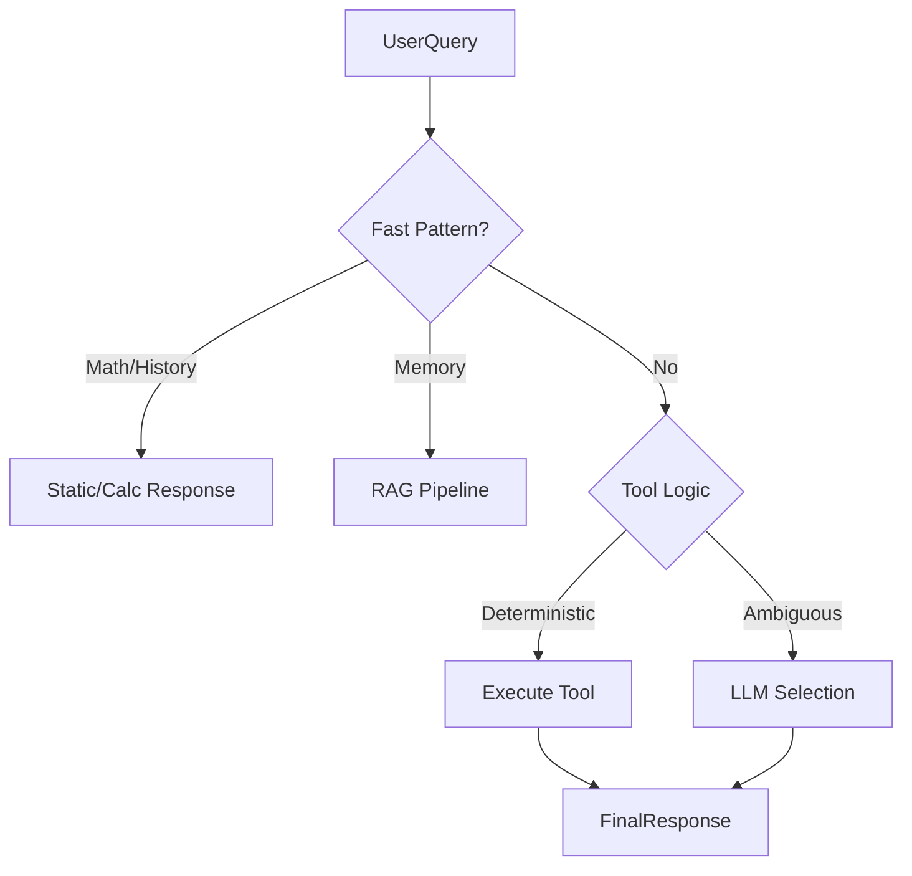

# Phase 6.5: Core Stabilization & Deterministic Fast Path

## 1. Objective

Eliminate nondeterministic AI behavior for known/simple queries to improve speed (TTFB < 300ms) and accuracy. Stabilize existing tools (Weather, WorldBank) and infrastructure (Embedding).

## 2. Hard Requirements

### 2.1 Deterministic Fast Path Layer (Node.js Only)

**Before** standard AI/Tool selection, intercept messages matching specific patterns.

1.  **Pure Math**: `2+2`, `(50*3)/10` -> Calculate using `mathjs`. **NO AI.**
2.  **Static History**: "รัชกาลที่ 3" -> Immediate lookup from `THAI_HISTORY_KB`. **NO AI.**
3.  **Memory Explicit**: "เคยเก็บไว้", "สรุป ... ที่เคย" -> Force `IntelligencePipeline` memory path. **NO FileReader Tool.**

### 2.2 Deterministic Tool Selection

Refactor `selectTools()` to prioritize logic over AI guessing:

1.  **FastPatternCheck**: (Math, History, Weather 7-day, Memory regex).
2.  **SemanticHint / Keyword**: Strict keywords map to tools (e.g., "weather" -> weather tool).
3.  **AI Choice**: Only if above fail.

### 2.3 Disable "Chat Classification"

Remove the initial `chatWithOllama` classification call. Use the Fast Path and Tool Selector to determine intent.

### 2.4 Tool Fixes

- **Weather**: Split multi-province queries (e.g., "Bangkok and Chiang Mai") into parallel tool calls.
- **WorldBank**: Fix API URL format (`/country/TH/indicator/...`).
- **Embedding**: Silent fallback on error (no console spam).

## 3. Architecture Changes

## 4. Benchmarks

- **Math/History TTFB**: < 100ms
- **General Tool TTFB**: < 300ms
- **AI Call Reduction**: > 40% for typical regression test suite.
