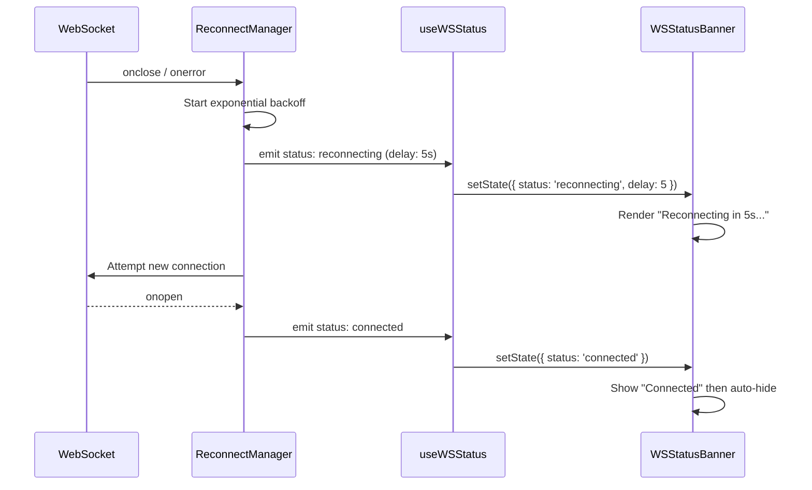

<!-- cc-team deliverable
 group: INT (Integration utilities, docs, quality tools)
 member: INT-26 role=doc model=moonshotai/Kimi-K2.6
 finish_reason: stop | tokens: {"prompt_tokens":77,"completion_tokens":2031,"total_tokens":2108,"prompt_tokens_details":{"cached_tokens":0,"audio_tokens":0,"video_tokens":0},"completion_tokens_details":{"reasoning_tokens":1628,"reasoning_tokens_estimated":true,"image_tokens":0},"cache_creation_input_tokens":0} | 15s
 generated: 2026-06-12T03:51:39.266Z -->
# WS-RECONNECT-DESIGN.md

## Overview
The WebSocket reconnection layer decouples connection state management from UI presentation. Three primitives—`ReconnectManager`, `useWSStatus`, and `WSStatusBanner`—collaborate to detect unexpected drops, orchestrate exponential-backoff retries, and surface status to users without leaking transport logic into presentational components.

## Components

**ReconnectManager** is a singleton transport wrapper that owns the raw WebSocket instance. It monitors `onclose` and `onerror` events, applies an exponential-backoff retry strategy with jitter, and attempts to re-establish the socket. It exposes a minimal event emitter interface so that state changes—connecting, open, closed, and waiting—can be observed by subscribers without importing React or DOM APIs.

**useWSStatus** is a React hook that subscribes to the `ReconnectManager` event emitter. It maintains local state for the current connection phase (`'connected' | 'reconnecting' | 'disconnected'`) and the number of seconds until the next retry attempt. By isolating subscription logic in a hook, any component can access live status declaratively without directly touching the WebSocket or managing its own listeners.

**WSStatusBanner** is a pure presentational component. It consumes the object returned by `useWSStatus` and conditionally renders a dismissible banner. It shows a "Reconnecting in Ns..." message during backoff, an error notice if the retry limit is exhausted, and a brief success indicator when the socket recovers, then auto-hides after a timeout.

## Composition
`ReconnectManager` lives at the application root and is instantiated once. Any view that needs awareness simply calls `useWSStatus()`, which registers a listener on mount and cleans up on unmount. `WSStatusBanner` is typically placed near the top of the layout tree and remains idle until the hook reports a non-connected state. This separation keeps the transport layer framework-agnostic while letting the UI react declaratively to connection health.

## Reconnect Flow

